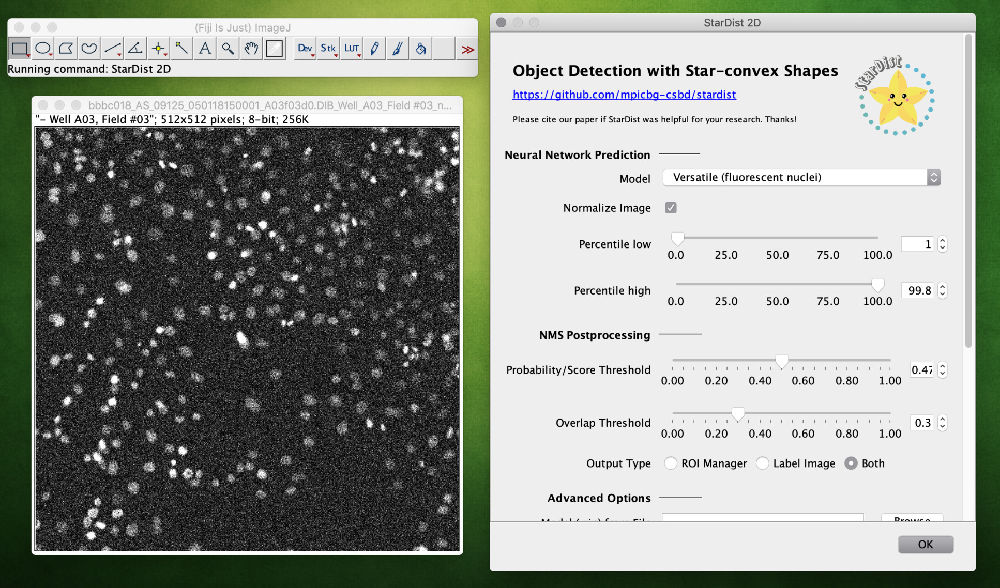

# StarDist ImageJ/Fiji Plugin

This is the ImageJ/Fiji plugin for [StarDist](https://github.com/mpicbg-csbd/stardist), which can be used to apply already trained models to new images.  
*Note: The plugin (currently) only supports 2D image and time lapse data.*

See the [main repository](https://github.com/mpicbg-csbd/stardist) for links to our publications and the full-featured Python package that can also be used to train new models.

## Installation

The StarDist plugin can be installed in [Fiji](https://fiji.sc) by selecting both update sites [`CSBDeep`](https://sites.imagej.net/CSBDeep/) and [`StarDist`](https://sites.imagej.net/StarDist/).  
Concretely, you can follow these steps:

1. Start Fiji (or download and install it from [here](https://fiji.sc) first).
2. Select `Help > Update...` from the menu bar.
3. Click on the button `Manage update sites`.
4. Scroll down the list and tick the checkboxes for update sites `CSBDeep` and `StarDist`, then click the `Close` button.  
(If `StarDist` is missing, click `Update URLs` to refresh the list of update sites.)
6. Click on `Apply changes` to install the plugin.
7. Restart Fiji.

## Usage

See the [wiki page](https://imagej.net/StarDist) for more information.
